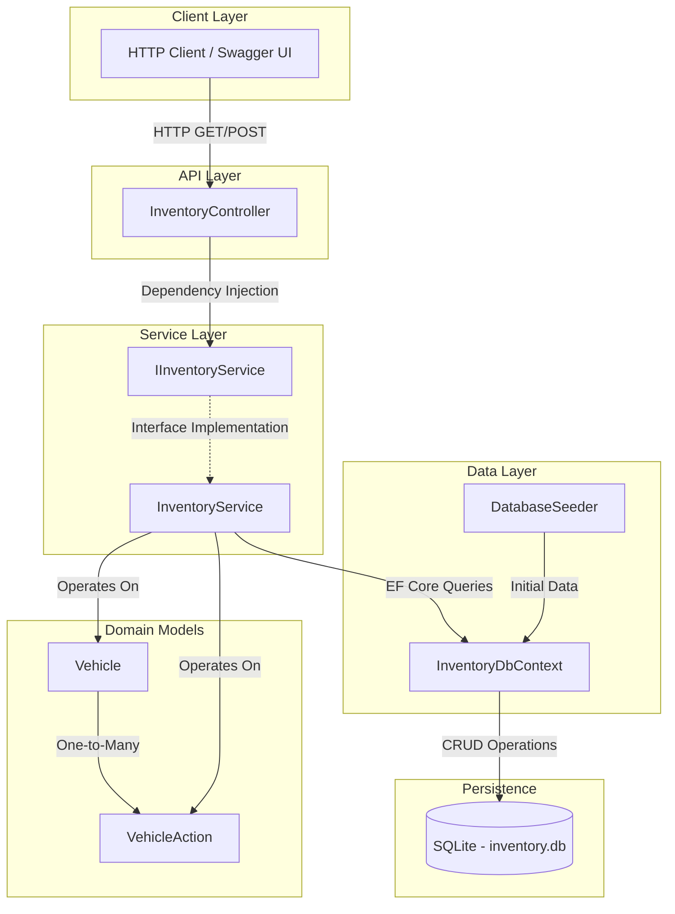
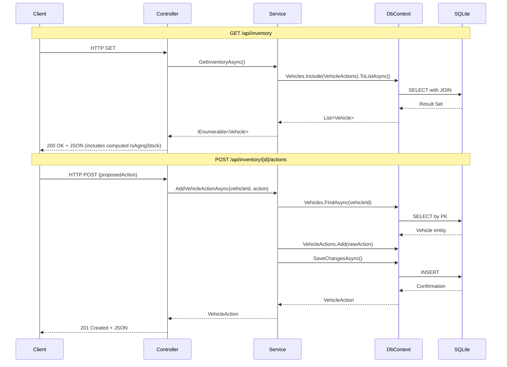

# System Design Document — Intelligent Inventory Dashboard

## 1. Architecture Overview

The Intelligent Inventory Dashboard is a backend service built on ASP.NET Core (.NET 8) following a layered architecture pattern. The system exposes RESTful API endpoints for vehicle inventory management, providing real-time aging analysis and action logging capabilities.

### Architecture Diagram



### Request Processing Flow



---

## 2. Component Descriptions

### Controllers (`Controllers/`)

| Component | Responsibility |
|-----------|---------------|
| `InventoryController` | Serves as the HTTP entry point. Routes incoming requests to the appropriate service methods, handles response formatting, and translates domain exceptions into proper HTTP status codes (e.g., `404 Not Found` for missing vehicles). |

The controller layer remains deliberately thin — it performs no business logic, validation beyond model binding, or data access. This ensures testability and adherence to the Single Responsibility Principle.

### Services (`Services/`)

| Component | Responsibility |
|-----------|---------------|
| `IInventoryService` | Defines the contract for inventory operations, enabling dependency inversion and facilitating unit testing through mocking. |
| `InventoryService` | Encapsulates all business logic including inventory retrieval with eager loading of related actions, vehicle existence validation, and action creation. |

The service layer acts as the orchestration boundary between the API surface and the persistence layer. It owns the transactional semantics and entity relationship management.

### Data Layer (`Data/`)

| Component | Responsibility |
|-----------|---------------|
| `InventoryDbContext` | Entity Framework Core database context that maps domain models to SQLite tables, manages change tracking, and provides `DbSet<T>` access points for querying. |
| `DatabaseSeeder` | Static utility that idempotently seeds initial inventory data on application startup, ensuring a consistent baseline for development and demonstration. |

### Domain Models (`Models/`)

| Component | Responsibility |
|-----------|---------------|
| `Vehicle` | Core domain entity representing a vehicle in inventory. Contains a computed property `IsAgingStock` that evaluates whether the vehicle has exceeded the 90-day inventory threshold — this logic is encapsulated within the model itself, ensuring consistency regardless of the access path. |
| `VehicleAction` | Represents a proposed action logged against a vehicle (e.g., price reduction, promotion). Maintains a foreign key relationship to `Vehicle` and auto-timestamps via `LoggedAt`. |

---

## 3. Data Flow

### Retrieving Inventory (`GET /api/inventory`)

1. The client issues an HTTP GET request to `/api/inventory`.
2. ASP.NET Core routing dispatches the request to `InventoryController.GetInventory()`.
3. The controller delegates to `IInventoryService.GetInventoryAsync()` via constructor-injected dependency.
4. `InventoryService` queries EF Core with `.Include(v => v.VehicleActions)` to perform eager loading, generating a SQL `LEFT JOIN` query against SQLite.
5. EF Core materializes the result set into `Vehicle` entities with their associated `VehicleAction` collections.
6. During JSON serialization, the computed property `IsAgingStock` is evaluated in real-time against `DateTime.UtcNow`, requiring no stored column.
7. The response is returned as `200 OK` with the full vehicle inventory including aging status and action history.

### Logging an Action (`POST /api/inventory/{vehicleId}/actions`)

1. The client issues an HTTP POST to `/api/inventory/{vehicleId}/actions` with a JSON body containing `proposedAction`.
2. The controller deserializes the request body into `AddActionRequest` and delegates to the service layer.
3. `InventoryService` first validates vehicle existence via `FindAsync(vehicleId)`.
4. If the vehicle does not exist, a `KeyNotFoundException` is thrown, which the controller translates to a `404 Not Found` response.
5. If valid, a new `VehicleAction` entity is constructed with the foreign key reference and auto-generated `LoggedAt` timestamp.
6. The entity is added to the change tracker and persisted via `SaveChangesAsync()`.
7. The controller returns `201 Created` with the newly created action entity.

---

## 4. Technology Choices and Justifications

| Technology | Version | Justification |
|-----------|---------|---------------|
| **C# / .NET** | 8.0 (LTS) | Industry-standard for enterprise backend services. Provides strong typing, async/await patterns, and a mature ecosystem. The LTS designation ensures long-term support and stability for production deployments. |
| **ASP.NET Core Web API** | 8.0 | High-performance, cross-platform HTTP framework with built-in dependency injection, model binding, and middleware pipeline. Minimal ceremony for RESTful API development. |
| **Entity Framework Core** | 8.0 | ORM that provides LINQ-based querying, change tracking, and migration support. Reduces boilerplate data access code while maintaining full control over generated SQL when needed. Eager loading via `.Include()` simplifies relationship traversal. |
| **SQLite** | via EF Core provider | Zero-configuration embedded database ideal for development, testing, and lightweight deployments. Eliminates external infrastructure dependencies while maintaining full SQL compatibility. Easily replaceable with SQL Server or PostgreSQL for production via provider swap. |
| **Swashbuckle (Swagger/OpenAPI)** | 6.5.0 | Auto-generates interactive API documentation from controller metadata. Accelerates development and testing by providing a browser-based test client without additional tooling. |

### Design Decisions

- **Computed `IsAgingStock` property**: Implemented as a C# expression-bodied member rather than a stored database column. This ensures the aging calculation is always current without requiring scheduled recalculation jobs or triggers.
- **Interface-based service abstraction**: Enables unit testing via mocking and supports future extensibility (e.g., decorators for caching or logging) without modifying consuming code.
- **Scoped DI lifetime**: `InventoryService` is registered as scoped, aligning its lifetime with the HTTP request and the `DbContext` instance — preventing stale data and concurrency issues.
- **JSON circular reference handling**: Configured `ReferenceHandler.IgnoreCycles` to gracefully handle bidirectional navigation properties during serialization.

---

## 5. Observability Strategy

### Current Implementation

The application leverages the built-in ASP.NET Core logging infrastructure configured via `appsettings.json`:

```json
{
  "Logging": {
    "LogLevel": {
      "Default": "Information",
      "Microsoft.AspNetCore": "Warning"
    }
  }
}
```

### Recommended Enhancements for Production

| Pillar | Approach |
|--------|----------|
| **Structured Logging** | Integrate Serilog with structured JSON output. Enrich log entries with correlation IDs, vehicle IDs, and operation outcomes to enable efficient querying in log aggregation platforms. |
| **Metrics** | Expose application-level metrics (request duration, inventory count, aging stock ratio) via OpenTelemetry. Track business KPIs alongside technical health indicators. |
| **Distributed Tracing** | Instrument EF Core queries and service method calls with `ActivitySource` spans. Correlate traces across services if the system expands to a microservices topology. |
| **Health Checks** | Implement ASP.NET Core health check endpoints (`/health`, `/health/ready`) that verify SQLite connectivity and report database row counts for operational monitoring. |
| **Alerting** | Define thresholds on aging stock percentage and action logging rate. Alert on anomalies such as sudden inventory spikes or prolonged periods without logged actions. |

### Implementation Priority

1. Structured logging with correlation IDs (immediate value, low effort).
2. Health check endpoints (enables load balancer integration).
3. OpenTelemetry metrics export (quantitative operational visibility).
4. Distributed tracing (critical when adding inter-service communication).

---

## 6. GenAI Design Assistance

This system was designed and implemented through an iterative, conversational collaboration with a generative AI assistant (Kiro, powered by Claude). The process reflects a modern development workflow where AI augments engineering decision-making while the developer retains architectural authority.

### Iterative Design Process

**Step 1 — Foundation and Domain Modeling**

The initial iteration focused on establishing the project scaffold and domain model. Through collaborative discussion, we defined the `Vehicle` and `VehicleAction` entities with careful attention to:

- Choosing a computed `IsAgingStock` property over a stored column, debating the trade-offs between query-time evaluation and pre-computed values.
- Establishing the one-to-many relationship between vehicles and actions with proper navigation properties.
- Selecting SQLite as the persistence layer for development simplicity while preserving the option to swap providers.

**Step 2 — Service Architecture and API Surface**

The second iteration introduced the layered architecture:

- The AI assistant proposed the interface-based service pattern to maintain separation of concerns and testability.
- Controller design followed RESTful conventions, with the AI generating appropriate HTTP verb mappings and status code responses.
- Error handling strategy (exception-to-HTTP-status translation) was established at the controller boundary.
- Database seeding logic was co-designed to include explicit aging stock test cases, validating the 90-day threshold computation.

### How AI Assisted the Process

| Aspect | AI Contribution |
|--------|----------------|
| **Scaffolding** | Generated project structure, NuGet references, and boilerplate configuration — eliminating manual setup time. |
| **Pattern Application** | Applied established .NET patterns (repository abstraction, DI registration, eager loading) consistently across the codebase. |
| **Edge Case Identification** | Proactively addressed JSON circular reference serialization and idempotent seeding before they manifested as runtime errors. |
| **Technology Compatibility** | Navigated framework version constraints (e.g., OpenAPI package availability across .NET versions) and adapted accordingly. |
| **Code Quality** | Maintained consistent naming conventions, null safety annotations, and async patterns throughout. |

### Human Oversight and Decision Authority

While the AI accelerated implementation, all architectural decisions — technology selection, layering strategy, API contract design, and domain modeling — were directed and approved by the developer. The AI served as a force multiplier for implementation velocity, not as a substitute for engineering judgment.

---

## Appendix: Project Structure

```
InventoryDashboard.Api/
├── Controllers/
│   └── InventoryController.cs
├── Data/
│   ├── DatabaseSeeder.cs
│   └── InventoryDbContext.cs
├── Models/
│   ├── Vehicle.cs
│   └── VehicleAction.cs
├── Services/
│   ├── IInventoryService.cs
│   └── InventoryService.cs
├── Properties/
│   └── launchSettings.json
├── appsettings.json
├── appsettings.Development.json
├── InventoryDashboard.Api.csproj
└── Program.cs
```
